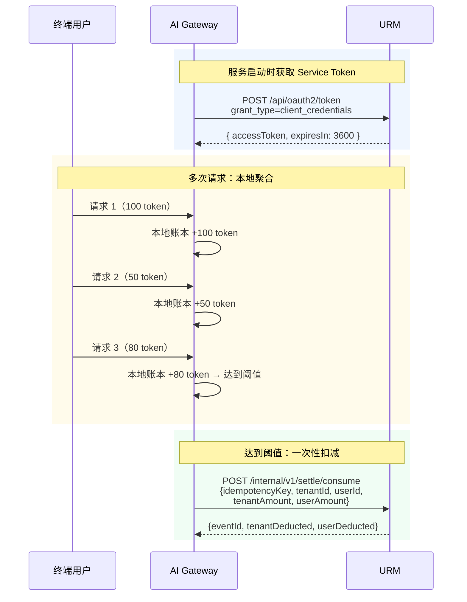
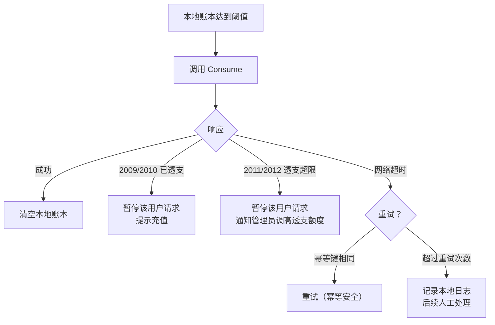
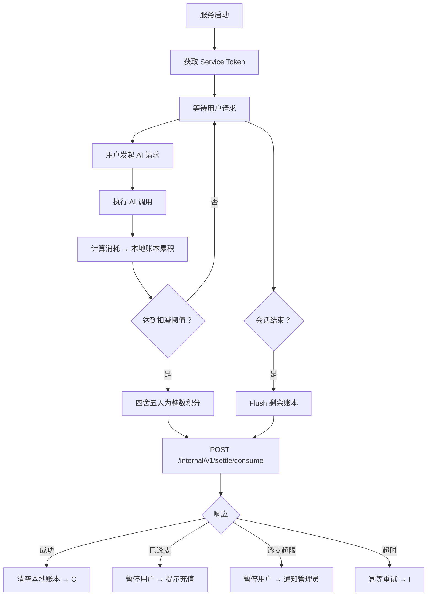

# AI Gateway 聚合扣费实战

AI Gateway（分账层）场景的典型特征：**先在本地聚合计费，再批量扣减**——业务系统在本地维护微积分账本，累积多次微小消费后达到阈值时，一次性调 URM 的 Consume 接口扣减整数积分。URM 的单阶段扣款模式天然适配这一场景。

---

## 接入总览



---

## 前置条件

本场景需要已完成 URM 接入初始化，持有有效的 Service Token。如尚未完成，请联系 URM 管理员完成以下步骤：

1. **初始化 Client 凭据** — 调用 `POST /api/v1/clients/bootstrap-secret` 获取 `clientId` 和 `clientSecret`
2. **获取 Service Token** — 调用 `POST /api/oauth2/token`（`grant_type=client_credentials`）获取 Service Token（有效期 1 小时）
3. **授予 Scope** — 在 URM 治理后台为 Client 授予所需 Scope

---

## 为什么选择 Consume 而不是 Freeze/Confirm？

| 特性 | 预授权模式（Freeze/Confirm） | 单阶段扣款模式（Consume） |
|------|-----------|---------------|
| 每次请求调用 URM | 2 次（Freeze + Confirm） | 0 次（本地聚合）+ 1 次（达到阈值时） |
| 网络开销 | 高（每次请求两次 RPC） | 低（聚合后一次 RPC） |
| 积分精度 | 无需关心（冻结额 > 实际额即可） | 需要本地维护微积分精度 |
| 透支支持 | 不支持 | 支持（受 overdraft_limit 限制） |
| 适用场景 | 单次请求消耗量不确定 | 多次请求聚合后消耗量确定 |

> **核心优势：** Consume 模式将 URM 调用频次从 2N 降低到 1（N = 用户请求次数），大幅减少网络开销和事务锁争用。

---

## 步骤 1：本地聚合计费

业务系统（AI Gateway）在本地维护一个微积分账本，累积每次请求的消耗：

```go
type LocalLedger struct {
    TenantID string
    UserID   string
    Entries  []LedgerEntry
    Total    int64 // 累积积分（微积分，如 1/1000 积分）
}

type LedgerEntry struct {
    RequestID string
    Tokens    int
    Credits   int64 // tokens × point_rate
    Timestamp time.Time
}
```

### 聚合策略

| 策略 | 说明 | 适用场景 |
|------|------|---------|
| 阈值触发 | 累积量达到 N 积分时触发扣减 | 通用场景，推荐 |
| 时间窗口 | 每 T 秒触发一次扣减 | 对延迟敏感的场景 |
| 混合模式 | 阈值 OR 时间窗口，先到先触发 | 推荐，兼顾精度和时效 |
| 请求退出 | 用户关闭会话时触发扣减 | 交互式场景 |

### 推荐配置

```go
const (
    ConsumeThreshold   = 500   // 累积 500 积分触发扣减
    FlushInterval      = 60    // 最长 60 秒刷新一次
    MicroCreditFactor  = 1000  // 微积分精度：1 积分 = 1000 微积分
)
```

---

## 步骤 2：调用 Consume 扣减

当本地账本达到阈值时，将微积分四舍五入为整数积分，调用 Consume 一次性扣减：

```
POST /internal/v1/settle/consume
Authorization: Bearer <service_token>
Content-Type: application/json

{
  "idempotencyKey": "GW-CONSUME-20260524-a1b2c3d4",
  "tenantId": "T_001",
  "userId": "EU_100",
  "description": "AI Gateway 聚合扣款（5次请求，明细见业务系统）",
  "tenantAmount": 350,
  "userAmount": 150
}
```

**请求参数：**

| 字段 | 类型 | 必填 | 说明 |
|------|------|------|------|
| `idempotencyKey` | string | ✅ | 幂等键，建议格式：`GW-CONSUME-{日期}-{uuid[:8]}` |
| `tenantId` | string | ✅ | 租户 ID |
| `userId` | string | ❌ | 终端用户 ID（纯租户扣费可省略） |
| `description` | string | ❌ | 建议包含聚合次数和明细指引 |
| `tenantAmount` | int64 | ❌ | 扣减租户积分（与 `userAmount` 至少填一个） |
| `userAmount` | int64 | ❌ | 扣减用户积分（与 `tenantAmount` 至少填一个） |

**响应：**

```json
{
  "code": 0,
  "data": {
    "eventId": "EV_abc123def456ghi789jkl012",
    "tenantDeducted": 350,
    "userDeducted": 150,
    "tenantOverdraftAdd": 0,
    "userOverdraftAdd": 0,
    "status": "SUCCESS"
  }
}
```

### 透支场景处理

当积分包余额不足时，Consume 允许走透支额度：

```json
{
  "code": 0,
  "data": {
    "eventId": "EV_xyz789",
    "tenantDeducted": 300,
    "userDeducted": 150,
    "tenantOverdraftAdd": 50,
    "userOverdraftAdd": 0,
    "status": "SUCCESS"
  }
}
```

- `tenantOverdraftAdd > 0` 表示租户积分包不够，50 积分计入了透支
- 下次 Consume 前必须充值清欠，否则 URM 返回错误码 2009

### 错误处理

| 错误码 | 说明 | 处理建议 |
|--------|------|---------|
| 2009 | 租户已透支 | 暂停该租户的请求，提示充值 |
| 2010 | 用户已透支 | 暂停该用户的请求，提示充值 |
| 2011 | 租户透支额度用尽 | 积分包不足且透支超限，暂停请求 |
| 2012 | 用户透支额度用尽 | 积分包不足且透支超限，暂停请求 |

---

## 步骤 3：异常处理

### 余额不足时的降级策略



### 网络超时重试

Consume 接口使用 `idempotencyKey` 保证幂等性，网络超时可以安全重试：

```go
for i := 0; i < 3; i++ {
    resp, err := client.Consume(ctx, req)
    if err == nil {
        // 成功，清空本地账本
        break
    }

    // 已透支类错误，不重试
    var bizErr *domain.BizError
    if errors.As(err, &bizErr) && bizErr.Code >= 2009 && bizErr.Code <= 2012 {
        // 标记用户暂停
        break
    }

    time.Sleep(time.Duration(i*i) * 100 * time.Millisecond)
}
```

### 会话结束时未达阈值

用户关闭会话时，本地账本可能未达到阈值。建议：

1. **会话结束时主动 Flush**：无论累积量多少都发起一次 Consume
2. **设置最小扣减量**：避免过小的 Consume 请求（建议 ≥ 10 积分）
3. **本地持久化**：将未 Flush 的账本写入本地存储，下次会话继续累积

---

## 微积分精度处理

业务系统在本地以微积分（如 1/1000 积分）计算，Consume 时四舍五入为整数积分：

```go
func roundToCredits(microCredits int64) int64 {
    // 1 积分 = 1000 微积分
    credits := microCredits / 1000
    remainder := microCredits % 1000
    if remainder >= 500 {
        credits++
    }
    return credits
}
```

> **注意：** 四舍五入可能导致微量偏差（每次最多 ±0.5 积分）。建议在 description 中记录原始微积分量，便于后续对账。

---

## 完整流程图



---

## 相关文档

- URM 计费结算 API（含 Consume 接口详细说明）— 参见 URM 文档 `docs/api/internal-billing.md`
- URM 计费体系全解（预授权模式、单阶段扣款、透支机制详解）— 参见 URM 文档 `docs/core/billing.md`
- URM 错误码速查（含透支相关错误码 2009-2012）— 参见 URM 文档 `docs/reference/error-codes.md`

---

**最后更新：** 2026-05-24
